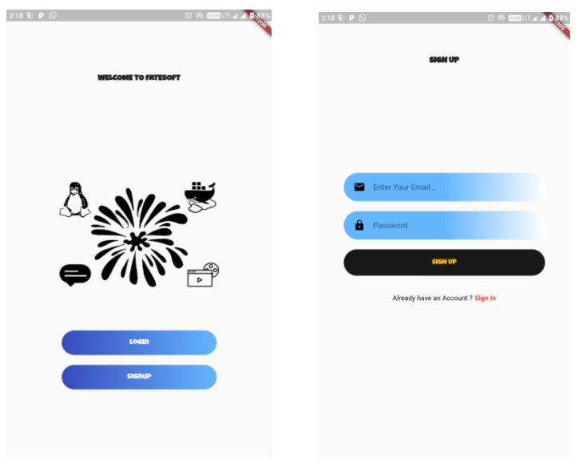
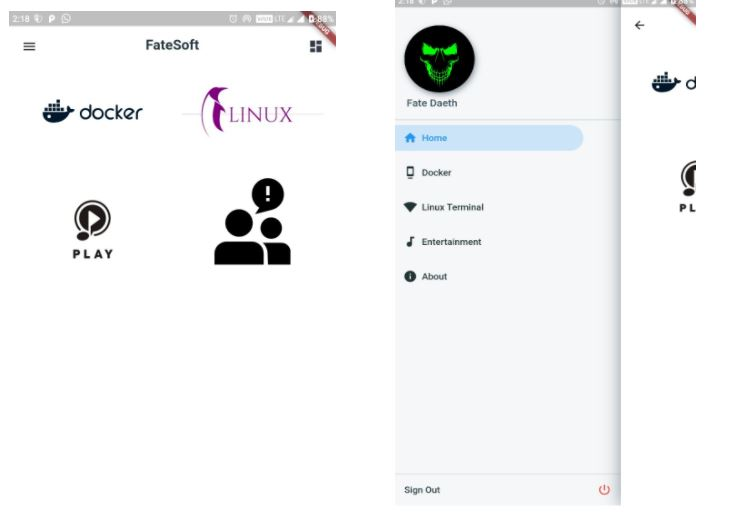
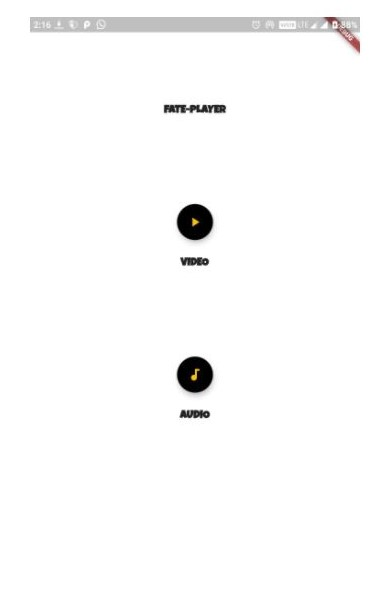
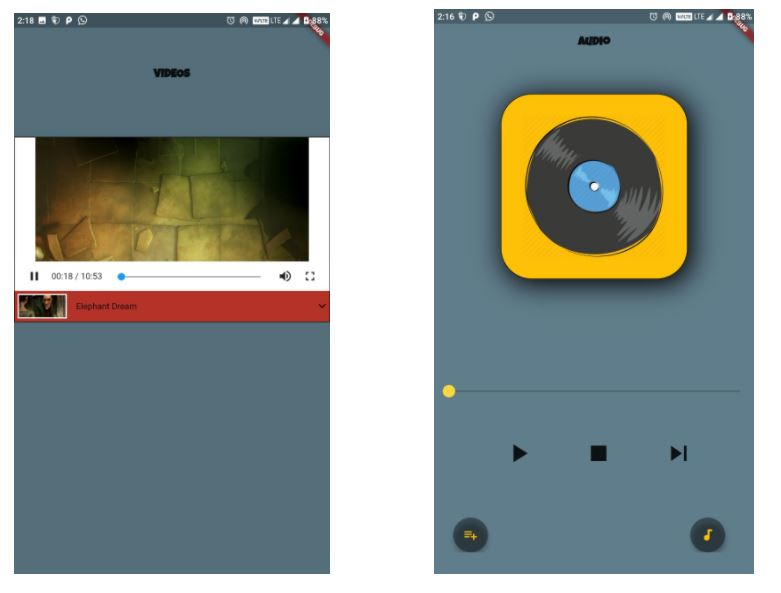
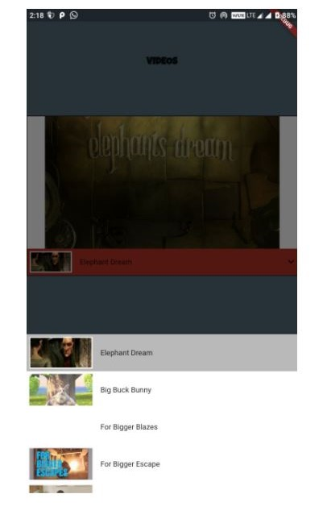
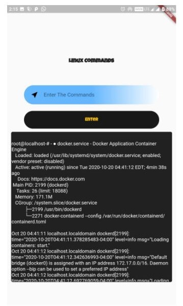

# Flutter_LW

## THIS IS A SAMPLE PROJECT TO UNDERSTAND THE INTEGRATION OF VARIOUS TECHNOLOGIES AND FUNCTIONALITIES OF FLUTTER APPLICATION.

 
 
 

## Task 1 : Flutter App Development
 
 * Task was to create a UI for Audio and Video Player .
 
 
 
 
 * I have used audioplayers and videos_player lib from pub.dev
 
 * Added an additional functionality using "file_picker" lib to access the device audio to play.
 
 * In order to play online Videos added "url_launcher" to play online using vodeos_players lib.
 
 * I have added an stack in online play which will automatically play the next audio.
 
 
 
## Task 3 & 4 : Flutter App Development 
 
  
  
* Created an app that can run any linux command using API
* Output will be saved in Firestore. 
* From Firestore, get this output and print on screen
* Use Stream Builder to save data.

## Task 6 : Flutter App Development
 
 * created amazing and unique animation in the application which stacks the container in delayed.
 

